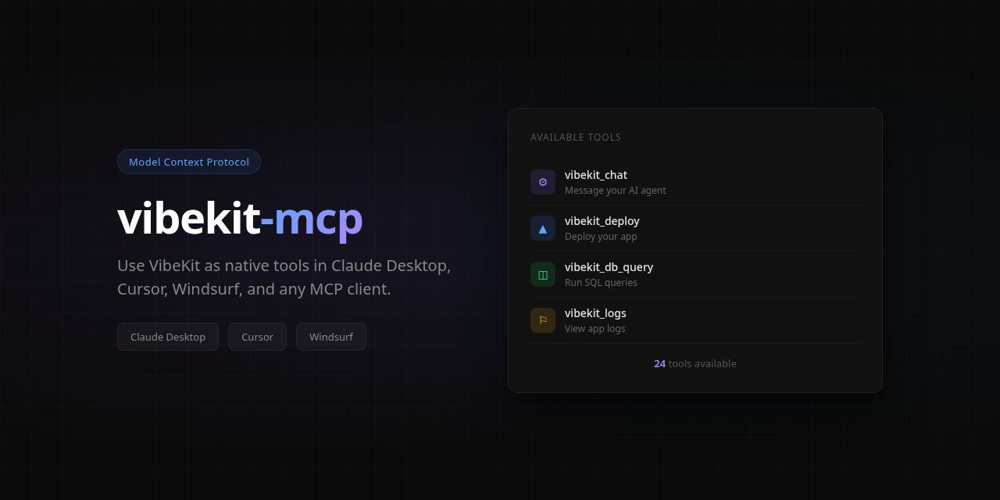

<p align="center">
  
</p>

# vibekit-mcp

MCP server for [VibeKit](https://vibekit.bot) — manage AI-powered apps as native tools in Claude Desktop, Cursor, Windsurf, and any MCP-compatible client.

## Setup

### Claude Desktop

Add to your `claude_desktop_config.json`:

```json
{
  "mcpServers": {
    "vibekit": {
      "command": "npx",
      "args": ["-y", "vibekit-mcp"],
      "env": {
        "VIBEKIT_API_KEY": "vk_your_key_here"
      }
    }
  }
}
```

### Cursor

Add to `.cursor/mcp.json` in your project:

```json
{
  "mcpServers": {
    "vibekit": {
      "command": "npx",
      "args": ["-y", "vibekit-mcp"],
      "env": {
        "VIBEKIT_API_KEY": "vk_your_key_here"
      }
    }
  }
}
```

Get your API key at [app.vibekit.bot/settings](https://app.vibekit.bot/settings).

## Available Tools

### Apps
- `vibekit_list_apps` — List all your hosted apps
- `vibekit_app_info` — Get app details
- `vibekit_start` / `vibekit_stop` / `vibekit_restart` — Container control

### AI Agent
- `vibekit_chat` — Send a message to your app's AI agent
- `vibekit_agent_status` — Agent status and model info

### Deploy
- `vibekit_deploy` — Trigger redeploy
- `vibekit_deploys` — Deploy history
- `vibekit_rollback` — Rollback to previous deploy

### Logs & Files
- `vibekit_logs` — View app logs
- `vibekit_files` — Browse workspace files

### Environment
- `vibekit_env_list` / `vibekit_env_set` / `vibekit_env_delete` — Manage env vars

### Database
- `vibekit_db_status` — Database stats
- `vibekit_db_schema` — Tables, columns, types
- `vibekit_db_query` — Run read-only SQL
- `vibekit_db_table` — Browse table data

### Domain & QA
- `vibekit_set_domain` — Set custom domain
- `vibekit_qa` — Run QA audit

### Tasks
- `vibekit_submit_task` — Submit a headless coding task
- `vibekit_task_status` — Check task status
- `vibekit_account` — Plan, balance, usage

## Example Usage

Once connected, you can say things like:

- "List my VibeKit apps"
- "Show me the logs for my surf app"
- "Tell my agent to add a dark mode toggle"
- "Run a SQL query on my database"
- "Deploy my app"

## Links

- Website: https://vibekit.bot
- Dashboard: https://app.vibekit.bot
- CLI: https://www.npmjs.com/package/vibekit-cli

## License

MIT
